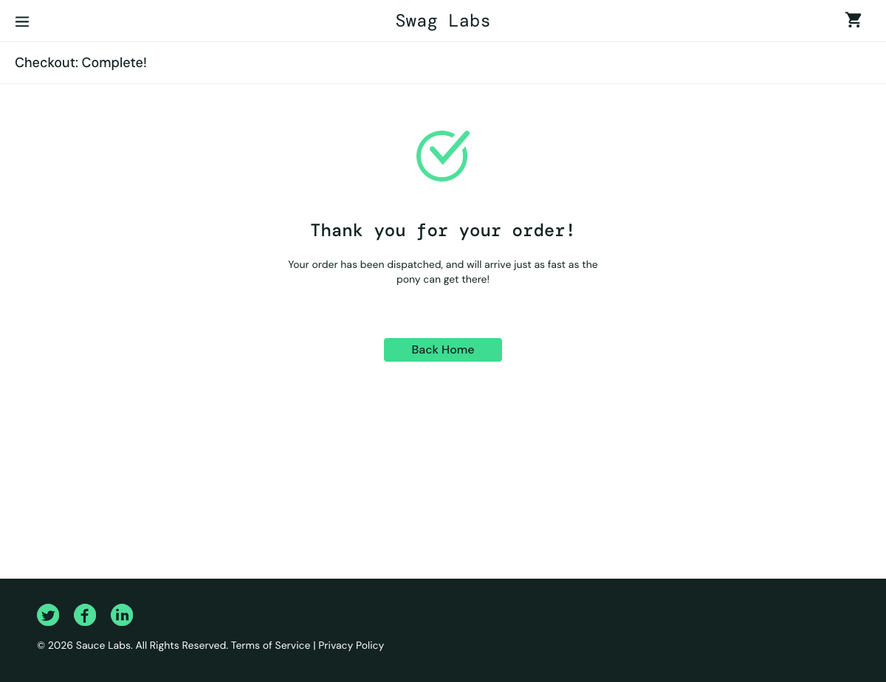

# Dogfood Report: SauceDemo

| Field | Value |
|-------|-------|
| **Date** | February 28, 2026 |
| **App URL** | https://www.saucedemo.com |
| **Session** | saucedemo-checkout |
| **Scope** | Checkout flow (shopping cart and order submission) |

## Summary

| Severity | Count |
|----------|-------|
| Critical | 0 |
| High | 0 |
| Medium | 0 |
| Low | 1 |
| **Total** | **1** |

## Issues

### ISSUE-001: Console errors on all pages - Failed API requests to Backtrace

| Field | Value |
|-------|-------|
| **Severity** | low |
| **Category** | console |
| **URL** | All pages (first noticed on login page) |
| **Repro Video** | N/A |

**Description**

Multiple HTTP 401 (Unauthorized) errors appear in the browser console on every page load for Backtrace API endpoints. These appear to be analytics/error reporting service calls that are failing authentication. Additionally, there's a DOM warning about missing autocomplete attribute on the password field.

**Repro Steps**

1. Navigate to https://www.saucedemo.com
   

2. Open browser developer tools and check console
   
3. **Observe:** Multiple console errors show:
   - "Failed to load resource: the server responded with a status of 401 (Unauthorized)" for backtrace.io API calls
   - "Input elements should have autocomplete attributes" DOM warning



<details>
<summary>Page snapshot (DOM/accessibility tree)</summary>

```
Console log showing:
[ERROR] Failed to load resource: the server responded with a status of 401 (Unauthorized) @ https://events.backtrace.io/api/summed-events/submit?universe=UNIVERSE&token=TOKEN
[ERROR] Failed to load resource: the server responded with a status of 401 (Unauthorized) @ https://events.backtrace.io/api/unique-events/submit?universe=UNIVERSE&token=TOKEN
[VERBOSE] [DOM] Input elements should have autocomplete attributes (suggested: "current-password")
```

</details>

---

## Checks with no issues

*List of areas/actions that were exercised during dogfooding and showed no errors. No evidence required — for full picture of coverage only.*

- **Authentication:** Login flow works correctly with valid credentials
- **Product catalog:** All products load with correct prices, images, and descriptions 
- **Add to cart:** Successfully adds products to cart, updates cart counter
- **Cart page:** Displays added items correctly with quantities, prices, and descriptions  
- **Remove from cart:** Successfully removes individual items, updates cart counter and totals
- **Cart calculations:** Running total and quantity counts update correctly
- **Checkout form:** All form fields accept valid input (first name, last name, postal code)
- **Form validation:** Continue button advances to next step after filling required fields
- **Checkout summary:** Order summary displays correct items, quantities, and pricing breakdown
- **Payment information:** Mock payment details display correctly ("SauceCard #31337")
- **Shipping information:** Shipping method displays correctly ("Free Pony Express Delivery!")
- **Tax calculation:** Tax amount ($3.68) calculates correctly for subtotal ($45.98)
- **Final total:** Final total ($49.66) calculates correctly (subtotal + tax)
- **Order completion:** Finish button successfully completes order, redirects to confirmation page
- **Navigation:** All navigation elements (menu, cart icon, continue shopping) function properly
- **Product sorting:** Sort dropdown is accessible and working (Name A-Z selected by default)